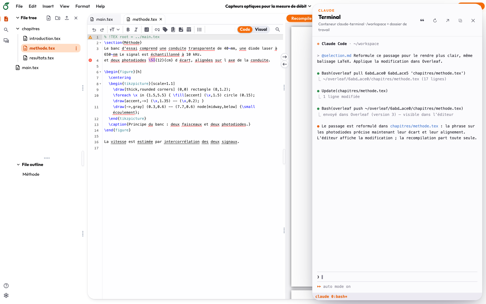
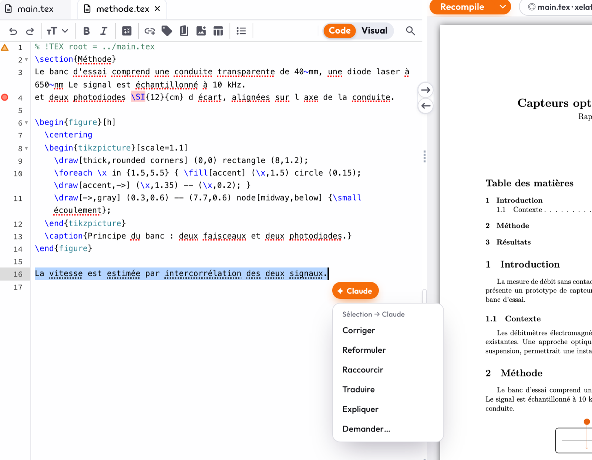
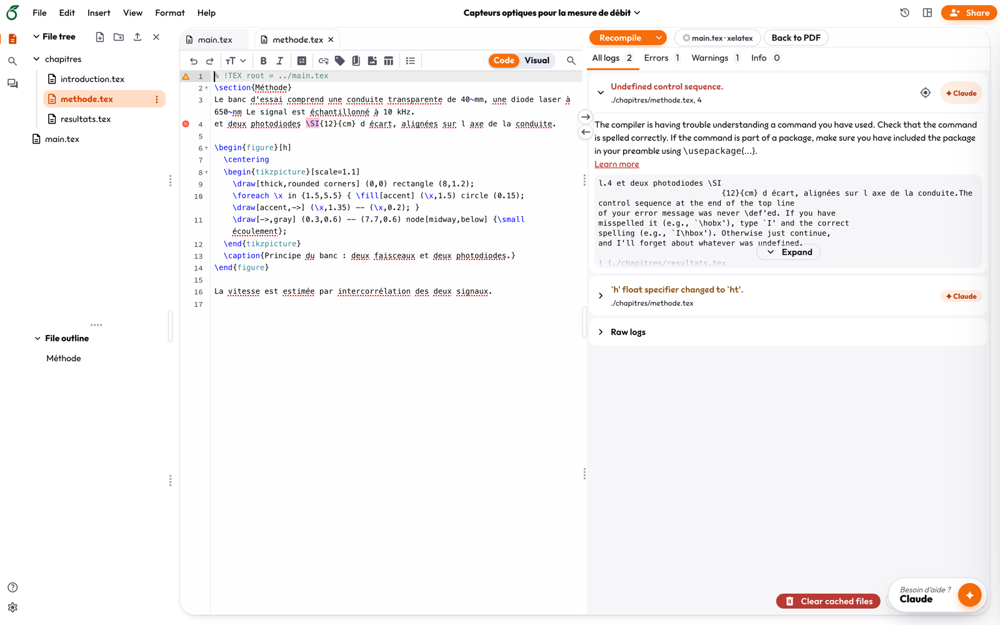
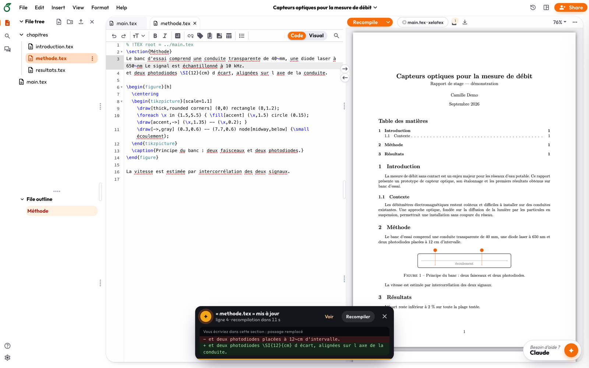
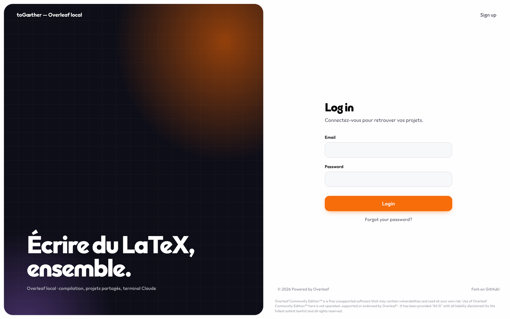
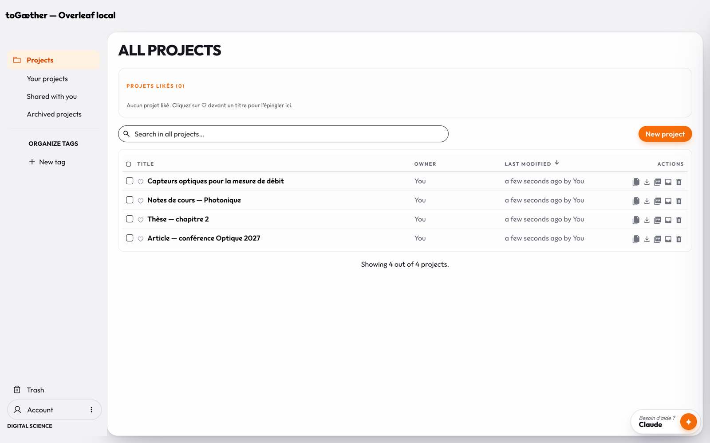
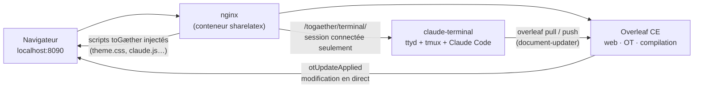

<h1 align="center">TextDestroyer</h1>

<p align="center"><b>Overleaf local + Claude Code</b></p>

<p align="center">
  Votre propre Overleaf, sur votre machine, avec <a href="https://claude.com/claude-code">Claude Code</a> branché directement dans l'éditeur.<br>
  Linux · macOS · Windows (WSL2) — tout tourne dans Docker, rien ne quitte votre poste à part les échanges avec Claude.
</p>

<p align="center">
  
</p>

---

Une instance [Overleaf Community Edition](https://github.com/overleaf/overleaf), construite sur l'[Overleaf Toolkit](https://github.com/overleaf/toolkit), à laquelle s'ajoutent :
- un terminal Claude Code intégré ;
- des raccourcis de l'éditeur vers Claude ;
- un thème revu ;
- quelques outils qui manquent au quotidien : compiler le document ouvert, figures en un glisser, import en masse.

Claude ne travaille pas sur une copie à côté. Il lit et modifie les documents **dans l'éditeur, en direct**, compile pour vérifier son travail, puis vous rend la main.

## Fonctionnalités

### Un terminal Claude dans l'éditeur

Le bouton **Claude** en bas à droite (ou <kbd>Ctrl</kbd> + <kbd>`</kbd>) ouvre un vrai terminal Claude Code. On peut l'afficher en tiroir ou en fenêtre flottante, à déplacer, redimensionner ou réduire. La session tmux survit à la fermeture du panneau et au rechargement de la page.

Dans le terminal, l'outil `overleaf` donne à Claude un accès direct aux projets :

| Commande | Effet |
|---|---|
| `overleaf projects` · `overleaf ls <projet>` | lister les projets et leurs documents |
| `overleaf grep <projet> '<motif>'` | chercher dans tous les documents d'un projet |
| `overleaf pull …` puis `overleaf push …` | modifier un document ; la modification apparaît en direct dans l'éditeur |
| `overleaf upload <projet> <fichier>` | ajouter une image ou un fichier au projet |
| `overleaf compile <projet>` | compiler une copie et résumer les erreurs, références indéfinies et *overfull* |

### Sélection → Claude



Sélectionnez du texte : une pastille **✦ Claude** apparaît au bout de la sélection, avec les actions **Corriger**, **Reformuler**, **Raccourcir**, **Traduire**, **Expliquer** et **Demander…**.

Claude reçoit le passage avec son contexte : projet, fichier, lignes et commande pour le modifier. Il applique la correction dans Overleaf en ne touchant qu'à ce passage.

Quand le panneau est ouvert, une sélection qui reste stable part aussi toute seule dans l'invite de Claude, sans être validée.

<br clear="right">

### Erreurs de compilation → Claude

Chaque erreur et chaque avertissement du journal reçoit un bouton **✦ Claude**. Un bouton **Tout envoyer à Claude** apparaît dès qu'il y a plusieurs erreurs. Claude reçoit le message, l'emplacement et l'extrait de source autour de la ligne fautive. Il corrige, puis recompile pour vérifier.



### Modifications en direct, sans fenêtre bloquante

Quand Claude pousse une modification, Overleaf affichait une fenêtre modale « Document Updated Externally ». Elle est remplacée par un **toast discret** en bas de l'écran :
- il indique le fichier et les lignes touchées ;
- il **recompile tout seul** à la fin du décompte ;
- la croix ou <kbd>Échap</kbd> annulent la recompilation, et le survol met le décompte en pause.

Si vous étiez **en train d'écrire dans la section modifiée**, le toast passe en alerte et montre le passage remplacé, avant et après, avec un bouton **Voir**. Une modification dans une autre section ou un autre fichier reste silencieuse.



### Glisser-déposer vers Claude

Tout ce qui se glisse sur le panneau Claude arrive dans son invite :
- **fichiers du système** : les images sont jointes comme images ;
- **documents, fichiers et dossiers de l'arborescence** : un dossier arrive avec la liste de ses documents ;
- **onglets de l'éditeur** ;
- **texte et liens** sélectionnés dans l'éditeur, le PDF ou une page web.

On peut aussi coller une capture d'écran directement dans le terminal avec <kbd>⌘</kbd>/<kbd>Ctrl</kbd> + <kbd>V</kbd>.

### Et aussi

- **Figure express** : une image déposée ou collée dans l'éditeur est importée dans `figures/` et la figure est insérée. Les SVG sont convertis en PDF, les HEIC en JPEG, et les grandes photos sont réduites. Maintenez <kbd>⌥</kbd>/<kbd>Alt</kbd> en déposant pour retrouver la fenêtre d'origine d'Overleaf.
- **Compiler le document ouvert** plutôt que le document principal. `% !TEX root` et `% !TEX program` sont respectés, et une pastille à côté de *Recompile* montre la cible.
- **Compilation accélérée** : dossiers de compilation sur volumes Docker et `xdvipdfmx -z 6`.
- **Projets likés**, épinglés en haut du tableau de bord.
- **Import en masse** de dossiers, de zips ou de l'export global d'overleaf.com.
- **Interface revue** : police Outfit, accent orange, panneaux arrondis, page de connexion redessinée.

<table>
  <tr>
    <td width="50%"></td>
    <td width="50%"></td>
  </tr>
  <tr>
    <td align="center"><sub>Connexion</sub></td>
    <td align="center"><sub>Tableau de bord</sub></td>
  </tr>
</table>

## Installation rapide

Prérequis :
- **Docker**, avec Docker Compose v2 ;
- **`make`**, `curl`, `openssl` et `zip` ;
- sous macOS, en plus : `brew install make gnu-sed coreutils` ;
- sous Windows, **tout se fait dans WSL2**.

```bash
git clone https://github.com/LeChar111/TextDestroyer.git && cd TextDestroyer
make install                       # vérifie, génère config/, construit les images (TeX Live : ~15 min la 1re fois)
make start                         # démarre et ouvre http://localhost:8090
make admin EMAIL=vous@exemple.org  # crée le compte administrateur (lien d'activation affiché)
```

Au premier clic sur **Claude**, connectez-vous à Claude Code dans le terminal (lien + code). Les identifiants restent dans le volume Docker `claude-home`.

Le guide complet est dans **[LISEZMOI.md](LISEZMOI.md)** : prérequis détaillés par système, réglages, commandes `make`, import et pièges connus.

## Comment ça marche



- Les ajouts côté navigateur sont de simples scripts dans `custom/togaether/`, injectés par le nginx d'Overleaf (`custom/overleaf.conf`). **Aucune image Overleaf n'est modifiée** : une mise à jour d'Overleaf ne casse rien au-delà de quelques sélecteurs CSS.
- Le terminal tourne dans son propre conteneur. Il n'est **pas publié sur l'hôte** : seul le nginx d'Overleaf le relaie, et seulement pour une session Overleaf connectée.
- `overleaf push` passe par le service *document-updater* d'Overleaf. La modification est donc transformée (OT) comme celle d'un collaborateur, et apparaît en direct sans conflit.

## Sécurité — à lire

Ce projet est pensé pour **un usage personnel, sur votre propre machine**.

- Overleaf écoute sur `127.0.0.1` par défaut. Ne l'exposez pas sur un réseau sans proxy TLS ni réflexion préalable.
- Overleaf Community Edition compile le LaTeX **sans isolation**. Tous les utilisateurs de l'instance doivent être de confiance.
- Le conteneur `claude-terminal` a accès au **socket Docker de l'hôte**, pour recharger nginx ou redémarrer un conteneur. C'est un accès équivalent à root sur la machine. Retirez ce montage dans `config/docker-compose.override.yml` si vous n'en voulez pas.
- Claude Code agit avec votre compte Claude. Relisez ses modifications : l'historique d'Overleaf garde toutes les versions.

## Documentation

| | |
|---|---|
| [LISEZMOI.md](LISEZMOI.md) | installation, réglages, commandes, pièges connus |
| [claude-terminal/CLAUDE.md](claude-terminal/CLAUDE.md) | consignes données à Claude dans le terminal, fichiers de configuration |
| [doc/](doc/README.md) | documentation d'origine de l'Overleaf Toolkit (en anglais) |

## Licence et crédits

- Construit sur l'[Overleaf Toolkit](https://github.com/overleaf/toolkit) et [Overleaf](https://github.com/overleaf/overleaf), sous licence **AGPL-3.0** (voir [`LICENSE`](LICENSE)).
- Police [Outfit](https://github.com/Outfitio/Outfit-Fonts) : SIL Open Font License.
- Projet indépendant, **non affilié à Overleaf ni à Anthropic**. « Overleaf » est une marque de ses détenteurs.

Les captures d'écran montrent un compte et des projets de démonstration fictifs. Le terminal y affiche une session d'illustration.
